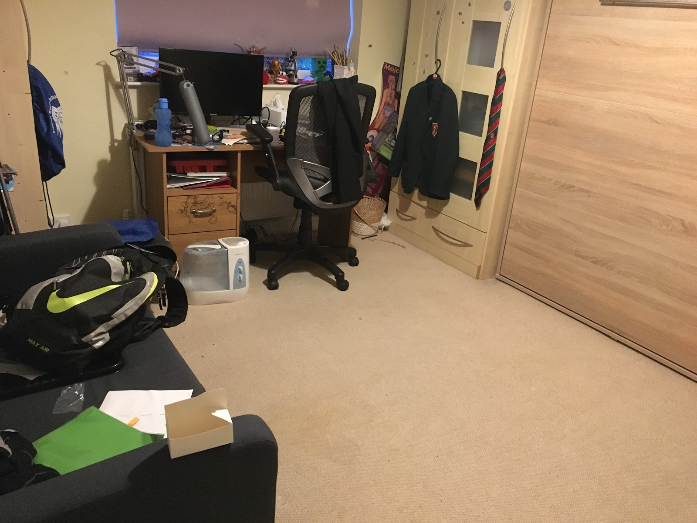

Salut!
C'est ma maison idéale :
Au rez-de-chaussée, il y a :
Une salle de bains, une cuisine, un salon, une salle à manger et une véranda
Au premier étage, il y a :
Une salle de bain, une buanderie, une chambre, un bureau et une armoire où sont rangés les serveurs.
Dans ma chambre idéale, il y en a une :
Un canapé-lit, un lit pliable, une bibliothèque, un bureau, une étagère et une armoire.

